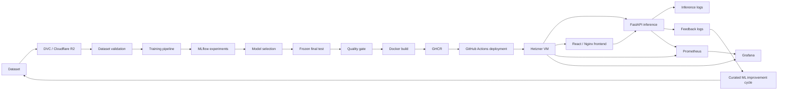

# Creator Support MLOps

Production-oriented MLOps project for multilingual customer-support intent classification.

The system classifies incoming Ukrainian and English support messages into one of 9 support intents, serves predictions through a FastAPI API and React chat UI, collects explicit user feedback, exposes production metrics through Prometheus and Grafana, and uses GitHub Actions to validate, train, evaluate, package, publish, and deploy approved model versions.

---

## Project Goals

The project demonstrates an end-to-end ML lifecycle:

- dataset creation and validation;
- dataset versioning with DVC;
- reproducible train/test splitting;
- model experimentation with MLflow;
- error analysis;
- targeted data augmentation;
- model comparison;
- frozen final-test evaluation;
- model quality gating;
- inference API;
- user-facing frontend;
- production logging and feedback collection;
- Prometheus monitoring;
- Grafana dashboards;
- Docker containerization;
- image publishing to GHCR;
- automated cloud deployment to Hetzner.

The goal is not only to train a classifier, but to build a reproducible, observable, and deployable ML system around it.

---

## Final Production Model

The final production model uses:

- `LinearSVC`
- word-level TF-IDF
- character-level TF-IDF
- `FeatureUnion`
- word n-grams: `(1, 2)`
- character n-grams: `(3, 5)`
- `C = 1.0`
- random state: `42`

Model selection was performed using grouped cross-validation on development data.

The final test set was frozen before iterative model improvement and evaluated only after model and dataset decisions had been completed.

### Final frozen-test results

| Metric | Result |
|---|---:|
| Accuracy | **0.8889** |
| Macro F1 | **0.8861** |
| Weighted F1 | **0.8861** |
| Errors | **4 / 36** |

Development records: `180`

Frozen final-test records: `36`

Dataset version: `dataset-v0.3`

---

## Intent Taxonomy

The classifier predicts one of 9 support intents:

```text
ACCESS_ACCOUNT
TECHNICAL_ISSUE
SCHEDULE_DEADLINE
SERVICE_INFO
CONTENT_USAGE_QUESTION
CHANGE_CANCEL
FEEDBACK_COMPLAINT
HUMAN_SUPPORT
OTHER
```

The dataset contains Ukrainian and English support messages across several creator and small-business support domains.

---

## Architecture



---

## Dataset Lifecycle

The canonical dataset is stored at:

```text
data/annotated/customer_support_intents.json
```

The dataset itself is tracked through DVC rather than Git.

Its DVC pointer is:

```text
data/annotated/customer_support_intents.json.dvc
```

Remote dataset storage uses Cloudflare R2.

Sensitive R2 credentials are never committed to Git.

The canonical dataset schema includes:

```text
id
scenario_id
text
language
domain
source
intent
```

`scenario_id` keeps semantically related examples together and helps prevent leakage between development and final-test partitions.

---

## Dataset Validation

Dataset validation is implemented in:

```text
scripts/validate_dataset.py
```

Validation runs in CI immediately after `dvc pull`.

If validation fails, model training does not continue.

---

## Frozen Final-Test Strategy

A fixed split manifest separates development data from final evaluation.

The final model pipeline expects:

```text
180 development records
36 final-test records
```

The final-test records are not used for:

- error-driven augmentation;
- hyperparameter selection;
- model comparison;
- iterative development decisions.

This reduces test-set leakage and overly optimistic evaluation.

---

## Model Development

### Initial baseline

The initial baseline used:

```text
TF-IDF + Logistic Regression
```

This provided a reproducible benchmark and exposed systematic classification errors.

### Error analysis

Out-of-fold predictions were used to inspect recurring confusion patterns.

Important error groups included:

```text
ACCESS_ACCOUNT ↔ TECHNICAL_ISSUE
SCHEDULE_DEADLINE ↔ CHANGE_CANCEL
OTHER ↔ CONTENT_USAGE_QUESTION
TECHNICAL_ISSUE ↔ SCHEDULE_DEADLINE
```

This showed that aggregate metrics alone were insufficient for deciding how to improve the model.

---

## Targeted Data Augmentation

Instead of blindly increasing dataset size, augmentation was targeted at the error patterns discovered during analysis.

Before targeted augmentation:

```text
Accuracy:  0.6481
Macro F1:  0.6355
Errors:    38
```

After targeted augmentation:

```text
Accuracy:  0.8519
Macro F1:  0.8498
Errors:    16
```

Improvement:

```text
Accuracy:  +0.2037
Macro F1:  +0.2143
Errors:    -22
```

The frozen final-test set was not used during this process.

One of the strongest findings of the project was that targeted data improvement produced a much larger gain than simple hyperparameter tuning.

---

## Model Comparison

The following model families and feature representations were compared:

```text
word TF-IDF + Logistic Regression
word n-gram TF-IDF + Logistic Regression
character TF-IDF + Logistic Regression
word TF-IDF + LinearSVC
character TF-IDF + LinearSVC
word + character TF-IDF + LinearSVC
```

After the dataset was improved, the best cross-validation configuration became:

```text
word + character TF-IDF
+
LinearSVC
```

Best development CV Macro F1:

```text
0.8039 ± 0.0706
```

An important project finding is that the preferred model changed after the dataset changed.

Therefore model comparison should be repeated after meaningful dataset improvements.

---

## MLflow

MLflow is used for experiment tracking during training.

Tracked information includes:

- dataset version;
- model type;
- feature representation;
- hyperparameters;
- development/final-test sizes;
- final metrics;
- classification report;
- confusion matrix;
- model metadata.

The model is registered under:

```text
customer-support-intent-classifier
```

---

## Production Quality Gate

Production benchmark metrics are stored in:

```text
config/production_model.json
```

Current production benchmark:

```text
Macro F1: 0.8861
Accuracy: 0.8889
Errors:   4
```

The quality gate is implemented in:

```text
scripts/quality_gate.py
```

The candidate passes only when:

```text
candidate_macro_f1 >= production_macro_f1
```

A candidate that performs worse than the current production model causes the CI pipeline to fail before deployment.

This reduces the risk of silent model regression.

---

## Inference API

The production inference API is implemented with FastAPI:

```text
backend/app.py
```

Main endpoints:

```text
GET  /health
GET  /metrics
POST /predict
POST /feedback
```

### Prediction request

```json
{
  "text": "I cannot access my account."
}
```

Example response:

```json
{
  "request_id": "generated-uuid",
  "intent": "ACCESS_ACCOUNT"
}
```

Each successful prediction receives a unique request ID that can later be associated with user feedback.

---

## User Feedback

The frontend allows users to mark a prediction as:

```text
correct
incorrect
```

For an incorrect prediction, the user can select the corrected intent.

The feedback flow records:

```text
request_id
timestamp
verdict
predicted_intent
corrected_intent
```

Raw message text is stored only for explicitly submitted incorrect-prediction feedback.

This creates useful material for later review while avoiding unnecessary raw-text storage for correct predictions.

---

## ML Improvement Cycle

The system deliberately does **not** retrain automatically after each user correction.

The intended production improvement cycle is:

```text
production traffic
        ↓
feedback collection
        ↓
error review
        ↓
human validation / curation
        ↓
dataset update
        ↓
DVC versioning
        ↓
training
        ↓
evaluation
        ↓
quality gate
        ↓
deployment
```

Human review remains between production feedback and the training dataset.

This protects the model from noisy, malicious, or incorrectly submitted feedback.

---

## Production Logging

Inference events are stored as JSONL records.

Inference log:

```text
artifacts/production/inference_log.jsonl
```

Recorded fields include:

```text
request_id
timestamp
message_length_chars
word_count
predicted_intent
duration_seconds
```

Feedback log:

```text
artifacts/production/feedback_log.jsonl
```

These logs support later error analysis and dataset improvement.

---

## Prometheus Metrics

The FastAPI service exports Prometheus metrics through:

```text
GET /metrics
```

Important custom metrics include:

```text
inference_predictions_total
inference_predictions_by_intent_total
inference_request_duration_seconds
inference_errors_total
inference_feedback_total
inference_corrections_total
```

---

## Grafana Monitoring

Grafana is automatically provisioned from repository configuration.

Dashboard:

```text
Customer Support Inference Monitoring
```

Main panels:

1. Average inference latency
2. Predictions per minute
3. Predictions by intent
4. User Feedback
5. Inference Errors
6. Prediction Corrections

Grafana configuration:

```text
monitoring/grafana/
```

Prometheus configuration:

```text
monitoring/prometheus/prometheus.yml
```

Monitoring was verified using real requests sent through the deployed chat UI.

---

## Frontend

The user-facing application is implemented with React and TypeScript.

Features include:

- Ukrainian and English UI;
- chat-style interaction;
- intent-specific responses;
- intent labels;
- explicit positive/negative feedback;
- corrected-intent selection;
- API error handling;
- frontend-to-backend proxy through Nginx.

The frontend communicates with:

```text
/api/predict
/api/feedback
```

in production.

---

## Docker

The application is containerized into separate services:

```text
frontend
inference
prometheus
grafana
```

Production orchestration is defined in:

```text
compose.production.yml
```

FastAPI and Prometheus are bound only to localhost on the production VM:

```text
127.0.0.1:8000
127.0.0.1:9090
```

The public application is exposed through the frontend/Nginx service.

Grafana is separately exposed for authenticated monitoring access.

Persistent Docker volumes are used for Prometheus and Grafana state.

---

## CI/CD

The GitHub Actions workflow is located at:

```text
.github/workflows/ml-cicd.yml
```

The production pipeline is:

```text
Train and validate model
        ↓
Dataset validation
        ↓
MLflow tracking
        ↓
Frozen-test evaluation
        ↓
Model quality gate
        ↓
Upload model artifact
        ↓
Build application
        ↓
Smoke tests
        ↓
Build Docker images
        ↓
Push images to GHCR
        ↓
Deploy to Hetzner
        ↓
Production health check
        ↓
Production prediction smoke test
```

Triggers:

```text
push to main
workflow_dispatch
```

---

## Deployment Traceability

Docker deployment images are published with two tags:

```text
latest
<git-commit-sha>
```

Production deployment uses the exact Git commit SHA:

```text
IMAGE_TAG=<github.sha>
```

This creates a direct traceability chain:

```text
Git commit
    ↓
GitHub Actions run
    ↓
trained model artifact
    ↓
Docker image
    ↓
GHCR SHA tag
    ↓
production deployment
```

This also provides the foundation for explicit rollback to a known previous image version.

---

## Production Environment

The production system runs on a Hetzner Cloud Linux VM.

Production stack:

```text
Ubuntu 24.04
Docker Engine
Docker Compose
React / Nginx
FastAPI
Prometheus
Grafana
```

Deployment is performed automatically from GitHub Actions through a dedicated SSH deployment user.

A separate personal SSH key is used for manual administration.

---

## Secrets

Secrets are not stored in Git.

Local production configuration:

```text
.env.production
```

is excluded through `.gitignore`.

A safe template is provided:

```text
.env.production.example
```

GitHub Actions secrets include credentials required for:

- Cloudflare R2 / DVC access;
- production SSH deployment.

---

## Local Development

### 1. Clone repository

```bash
git clone https://github.com/IamLoren/creator-support-mlops-final.git
cd creator-support-mlops-final
```

### 2. Create a virtual environment

Windows Git Bash:

```bash
python -m venv .venv
source .venv/Scripts/activate
```

Linux/macOS:

```bash
python -m venv .venv
source .venv/bin/activate
```

Install training dependencies:

```bash
python -m pip install -r requirements-training.txt
```

### 3. Pull dataset

Configure local DVC credentials first, then:

```bash
dvc pull
```

### 4. Validate dataset

```bash
python scripts/validate_dataset.py   --input data/annotated/customer_support_intents.json
```

### 5. Start MLflow

```bash
python -m mlflow server   --backend-store-uri sqlite:///mlflow.db   --artifacts-destination ./mlartifacts   --host 127.0.0.1   --port 5000
```

### 6. Train final model

In another terminal:

```bash
python training/finalize_model.py
```

### 7. Run quality gate

```bash
python scripts/quality_gate.py
```

### 8. Run local application

```bash
docker compose up --build
```

Frontend:

```text
http://127.0.0.1:8081
```

FastAPI:

```text
http://127.0.0.1:8000
```

Prometheus:

```text
http://127.0.0.1:9090
```

Grafana:

```text
http://127.0.0.1:3000
```

---

## Repository Structure

```text
.
├── .dvc/
├── .github/
│   └── workflows/
│       └── ml-cicd.yml
├── backend/
│   ├── app.py
│   └── Dockerfile
├── config/
│   └── production_model.json
├── data/
│   ├── annotated/
│   ├── augmentation/
│   └── splits/
├── docs/
│   ├── annotation_guidelines.md
│   └── final_findings.md
├── frontend/
├── monitoring/
│   ├── grafana/
│   └── prometheus/
├── scripts/
│   ├── build_dataset_v03.py
│   ├── create_split_manifest.py
│   ├── quality_gate.py
│   └── validate_dataset.py
├── training/
│   ├── compare_models.py
│   ├── error_analysis.py
│   ├── evaluate_augmentation_impact.py
│   ├── finalize_model.py
│   ├── review_errors.py
│   └── train.py
├── compose.yml
├── compose.production.yml
├── requirements-serving.txt
└── requirements-training.txt
```

---

## Key Findings

The main project findings are:

- data quality had a larger impact than basic hyperparameter tuning;
- error analysis was useful as a dataset-development tool;
- targeted augmentation significantly reduced systematic errors;
- model selection changed after the dataset changed;
- model comparison should therefore be repeated after major data updates;
- the final test set should remain isolated from iterative development;
- production feedback is valuable but should be curated before retraining;
- operational monitoring and model monitoring solve different problems;
- model quality gates reduce regression risk;
- dataset version, model artifact, Git commit, Docker image, and production deployment should be traceable.

Detailed findings are documented in:

```text
docs/final_findings.md
```

---

## Current Limitations

The current project is intentionally small and focuses on MLOps principles rather than model scale.

Important limitations include:

- relatively small custom dataset;
- only 9 intent classes;
- no confidence calibration for `LinearSVC`;
- no automated drift-triggered retraining;
- no automatic ingestion of user feedback into the training set;
- no human review UI for feedback curation;
- single-node production deployment;
- no Kubernetes orchestration;
- no HTTPS/domain configuration in the demo deployment.

---

## Future Improvements

Possible next steps include:

- larger Ukrainian and English production dataset;
- curated production-feedback ingestion pipeline;
- drift detection on real production traffic;
- multilingual embedding or transformer comparison;
- calibrated confidence scores;
- explicit low-confidence fallback to `HUMAN_SUPPORT` or `OTHER`;
- automated evaluation reports;
- rollback automation;
- HTTPS and domain configuration;
- infrastructure-as-code;
- Kubernetes deployment when system scale justifies it.

---

## Technology Stack

### Machine Learning

```text
Python
scikit-learn
TF-IDF
LinearSVC
MLflow
DVC
Cloudflare R2
```

### Backend

```text
FastAPI
Pydantic
joblib
Prometheus client
```

### Frontend

```text
React
TypeScript
Vite
Nginx
```

### Monitoring

```text
Prometheus
Grafana
JSONL production logs
```

### MLOps / DevOps

```text
Docker
Docker Compose
GitHub Actions
GitHub Container Registry
Hetzner Cloud
SSH deployment
```

---

## Final Result

The project implements a complete production-oriented ML lifecycle:

```text
versioned data
→ validated dataset
→ reproducible training
→ experiment tracking
→ error analysis
→ targeted improvement
→ frozen evaluation
→ model quality gate
→ containerized serving
→ automated CI/CD
→ cloud deployment
→ production monitoring
→ explicit user feedback
→ next ML improvement cycle
```

The model is not treated as a standalone `.joblib` file, but as one component of a reproducible and observable production system.
